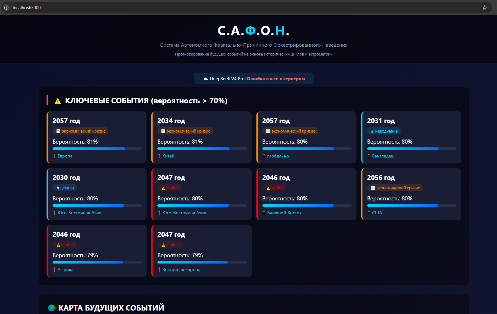
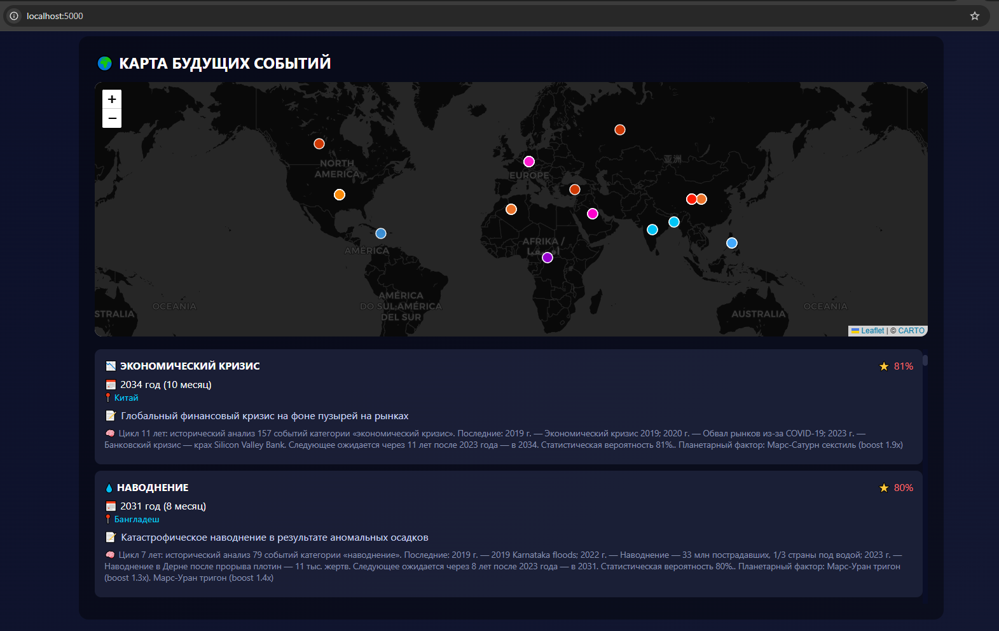

# С.А.Ф.О.Н. — Система прогнозирования будущих событий

**С.А.Ф.О.Н.** = **С**истема **А**втономного **Ф**рактально-**П**ричинного **О**ркестрированного **Н**аведения

Вероятностный исторический оракул, предсказывающий будущие события на основе анализа исторических циклов, причинно-следственных связей и астрометрических данных. Нейросеть DeepSeek V4 Pro классифицирует события, генерирует описания и находит скрытые паттерны.

[Понравился **КОД** кидай перевод](https://www.tbank.ru/rm/r_bOUXSKJuGV.XTgQkweVsD/wz2TK2079/)
---




## Принцип работы

История циклична. События повторяются через определённые промежутки времени, формируя паттерны. С.А.Ф.О.Н. выявляет эти паттерны и экстраполирует их в будущее:

1. **Фрактальные циклы** — поиск периодов на временных масштабах 5, 11, 25, 50, 100 лет
2. **Причинно-следственные связи** — события не изолированы, одно влечёт другое
3. **Астрометрические корреляции** — планетарные циклы коррелируют с земными событиями
4. **Нейросетевой анализ** — DeepSeek V4 Pro генерирует связные описания предсказаний

### Математическая модель

```
P_итог = P_историческая × W_астрометрия × W_время × W_источник
```

| Компонент | Описание |
|-----------|----------|
| **P_историческая** | Частота события в истории (совпадения / всего_циклов) |
| **W_астрометрия** | Планетарная корректировка — только повышает вероятность |
| **W_время** | 1 − (цикл_номер − 1) × 0.03 — дальние прогнозы менее надёжны |
| **W_источник** | Вес достоверности: Wikipedia 0.85 > встроенная база 0.7 |

---

## Схема работы

```
ЭТАП 1: СБОР ИСТОРИЧЕСКИХ ДАННЫХ
  Встроенная база (677 событий)  ─┐
  Wikipedia API                  ─┤──> База данных SQLite
  DuckDuckGo Search              ─┤    События с хеш-дедупликацией
  Ручной ввод                    ─┘    11 категорий, 1959 лет истории

ЭТАП 2: АНАЛИЗ ЦИКЛОВ И КОРРЕЛЯЦИЙ
  Фрактальный анализ ──> Поиск повторяющихся интервалов
                          Период → Частота → Уверенность
  Астрометрический    ──> Фазы планет на даты событий (Skyfield + NASA JPL)
  анализ                  lift = P_в_окне / P_ожидаемая
                          При lift > 1.3 → корреляция сохранена

ЭТАП 3: ГЕНЕРАЦИЯ ПРЕДСКАЗАНИЙ
  Последнее событие + найденный цикл = базовый прогноз
  Астрометрическое уточнение года (±3 года, макс. планетарная активность)
  Итоговая вероятность с учётом всех факторов
  DeepSeek AI генерирует развёрнутое описание (4-6 предложений)

ЭТАП 4: ВИЗУАЛИЗАЦИЯ
  Веб-интерфейс Flask + Leaflet/OpenStreetMap
  Ключевые события (вероятность ≥ 70%) + карта мира
  Причинно-следственный анализ с AI-описаниями
  Email-отчёт (опционально)
```

---

## Архитектура

```
                    ┌─────────────────────────┐
                    │   H: Навигатор будущего │
                    │   Предсказания 0-100%   │
                    └───────────┬─────────────┘
                                │
                    ┌───────────▼─────────────┐
                    │   O: Оркестратор        │
                    │   Байесовское обновление│
                    └───────────┬─────────────┘
                                │
         ┌──────────────────────┼──────────────────────┐
         │                      │                      │
  ┌──────▼──────┐     ┌─────────▼────────┐   ┌─────────▼────────┐
  │ F: Фракталы │     │ F: Причины       │   │ F: Астрометрия   │
  │ Поиск циклов│     │ Причины→Следствия│   │ Планетарные      │
  │ 5 уровней   │     │                  │   │ корреляции       │
  └──────┬──────┘     └─────────┬────────┘   └─────────┬────────┘
         └──────────────────────┼──────────────────────┘
                                │
                    ┌───────────▼─────────────┐
                    │   A: DeepSeek V4 Pro    │
                    │   Классификация + текст │
                    └───────────┬─────────────┘
                                │
                    ┌───────────▼─────────────┐
                    │   S: SQLite + Ядро      │
                    │   Дедупликация, миграция│
                    └─────────────────────────┘
```

---

## Компоненты

### Бэкенд (Python 3.11)

| Модуль | Ответственность |
|--------|-----------------|
| `core/database.py` | SQLite, дедупликация, миграция схемы, 677+ исторических событий |
| `core/deepseek_engine.py` | DeepSeek V4 Pro: API / LM Studio локально |
| `core/analyzer.py` | Классификация событий, AI-улучшение описаний |
| `core/astrometry.py` | Планетарные корреляции (Skyfield + NASA JPL) |
| `core/predictor.py` | Генерация прогнозов, поиск циклов, многопоточное AI |
| `core/history_enricher.py` | Wikipedia + DuckDuckGo, многопоточный поиск |
| `core/email_notifier.py` | Полноценный HTML-отчёт на почту |

### Фронтенд

| Компонент | Технология |
|-----------|-----------|
| Карта | Leaflet.js + OpenStreetMap (CartoDB Dark) — бесплатно |
| Интерфейс | Flask + HTML5 + CSS3 + JavaScript |
| Индикация | Динамический прогресс-бар, автообновление |

---

## База данных

- **677+ встроенных исторических событий** (64 г. н.э. — 2023 г.)
- **11 категорий**: войны, землетрясения, засухи, наводнения, экон. кризисы, эпидемии, революции, пожары, ураганы, цунами, экокатастрофы
- Автоматическая миграция схемы (ALTER TABLE без потери данных)
- UPSERT предсказаний (обновление вместо дублирования)

---

## Возможности

- Прогнозирование на **80 лет** (средняя продолжительность жизни)
- **Два режима нейросети**: облачный DeepSeek API / локальный LM Studio
- Автоматический поиск планетарных корреляций: 5 планет × 5 аспектов × 11 категорий
- Обогащение базы через Wikipedia API + DuckDuckGo (6 параллельных потоков)
- Интерактивная карта мира с маркерами событий
- Причинно-следственный анализ с AI-описаниями
- Email-оповещение с полноценным HTML-отчётом
- Фоновый режим работы с логированием

---

## Установка и запуск

```batch
install.bat              # Установка зависимостей (Python 3.11)
run.bat                  # Запуск с авто-открытием браузера
run_background.bat       # Фоновый режим
stop_background.bat      # Остановка
check_env.bat            # Диагностика
```

Открыть браузер: `http://localhost:5000`

---

## Технологии

| Компонент | Технология |
|-----------|-----------|
| Нейросеть | DeepSeek V4 Pro (API / LM Studio) |
| Веб | Flask + Flask-CORS |
| БД | SQLite |
| Карта | Leaflet.js + OpenStreetMap |
| Астрометрия | Skyfield (NASA JPL DE421) |
| Интернет-поиск | Wikipedia API + DuckDuckGo |
| Многопоточность | ThreadPoolExecutor |

---

*С.А.Ф.О.Н. — Версия 4.0 | Abonent0007 2026*
